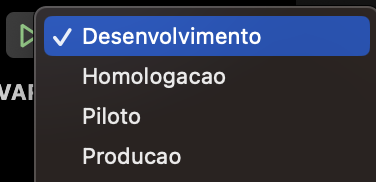

# app_config_flavors

Exemplo de como configurar Flavors utilizando dart-defines.

## Gerar build usando dart-define

Passos:

1. Criar o arquivo de env.seuAmbiente.json na raíz do seu projeto:

```
{
    "SYSTEM_CODE": "sXXX",
    "APP_NAME": "appDesenv",
    "SUFFIX_NAME": ".desenv",
    "BASE_URL": "https://ambiente_desenvolvimento.br",
    "SSO": "https://sso_url_desenvolvimento"
}

```
2. Criar os arquivos abaixo na pasta ios/Flutter/:

**Define-default.xcconfig**

````
APP_NAME=appDesenv
SUFFIX_NAME=.desenv
BASE_URL=https://ambiente_desenvolvimento.br
SSO=https://sso_url_desenvolvimento

````
**Define-xcconfig** 

(Podemos deixá-lo vazio pois será preenchido dinamicamente por um script)


3. Acrescentar os includes dos arquivos criados em **Debug.xcconfig** e **Relase.xcconfig**.

```
#include "Define-default.xcconfig"
#include "Define.xcconfig"

```

4. No arquivo **info.plist** adicionar as seguintes variáveis de ambiente:
````
<key>CFBundleDisplayName</key>
<string>$(APP_NAME)</string>

<key>CFBundleIdentifier</key>
<string>$(PRODUCT_BUNDLE_IDENTIFIER)$(SUFFIX_NAME)</string>

<key>CFBundleName</key>
<string>$(APP_NAME)</string>


````


**Configuração Android**

Adicionar o script abaixo no build.gradle (app):

```
apply from: ...

def dartEnvironmentVariables = [
    APP_NAME: 'app_config_flavors',
    SUFFIX_NAME: null
];

if (project.hasProperty('dart-defines')) {
    dartEnvironmentVariables = dartEnvironmentVariables + project.property('dart-defines')
            .split(',')
            .collectEntries { entry ->
                def pair = new String(entry.decodeBase64(), 'UTF-8').split('=')
                [(pair.first()): pair.last()]
            }
}

android {
    ...
    defaultConfig {
        
        applicationIdSuffix dartEnvironmentVariables.SUFFIX_NAME
        ...
        resValue "string", "app_name", dartEnvironmentVariables.APP_NAME
    }

    buildTypes {
        release {
            ...
            signingConfig signingConfigs.debug
        }

        applicationVariants.all{ variant ->            
                variant.outputs.all{                    
                    outputFileName = "${dartEnvironmentVariables.SYSTEM_CODE}-${dartEnvironmentVariables.APP_NAME}${dartEnvironmentVariables.SUFFIX_NAME}-${variant.name}-v${variant.versionName}-b${variant.versionCode}.apk"       
                        
                }
            
       }
    }

    ...
 }

 //No arquivo Manifest..
 <application
        android:label="@string/app_name"

```

Para gerar o arquivo apk ou bundle:

 **flutter build apk --dart-define-from-file=env.desenvolvimento.json --debug**


**Configuração IOS**

Adicionar o script abaixo no Pré-actions do Runner

```
function entry_decode() { echo "${*}" | base64 --decode; }

IFS=',' read -r -a define_items <<< "$DART_DEFINES"


for index in "${!define_items[@]}"
do
    define_items[$index]=$(entry_decode "${define_items[$index]}");
done

printf "%s\n" "${define_items[@]}"|grep '^' > ${SRCROOT}/Flutter/Define.xcconfig
```

### Edit Schema

### Pré-actions

### Build Script


Para gerar o arquivo ipa:

**flutter build ipa --dart-define-from-file=env.desenvolvimento.json**


### Configuração VSCode (opcional)

No VSCode precisamos definir o **launch.json** que irá facilitar a escolha dos ambientes.

### VSCode ambientes


````
"configurations": [
        {
            "name": "Desenvolvimento",
            "request": "launch",
            "type": "dart",
            "args": [
                "--dart-define-from-file",
                "env.desenvolvimento.json"
            ]
        },
        {
            "name": "Homologacao",
            "request": "launch",
            "type": "dart",
            "args": [
                "--dart-define-from-file",
                "env.homologacao.json"
            ]
        },
        {
            "name": "Piloto",
            "request": "launch",
            "type": "dart",
            "args": [
                "--dart-define-from-file",
                "env.piloto.json"
            ]
        },
        {
            "name": "Producao",
            "request": "launch",
            "type": "dart",
            "flutterMode": "release",
            "args": [
                "--dart-define-from-file",
                "env.producao.json"
            ]
        }
    ]

````


