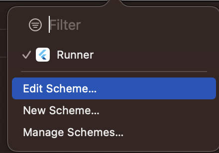
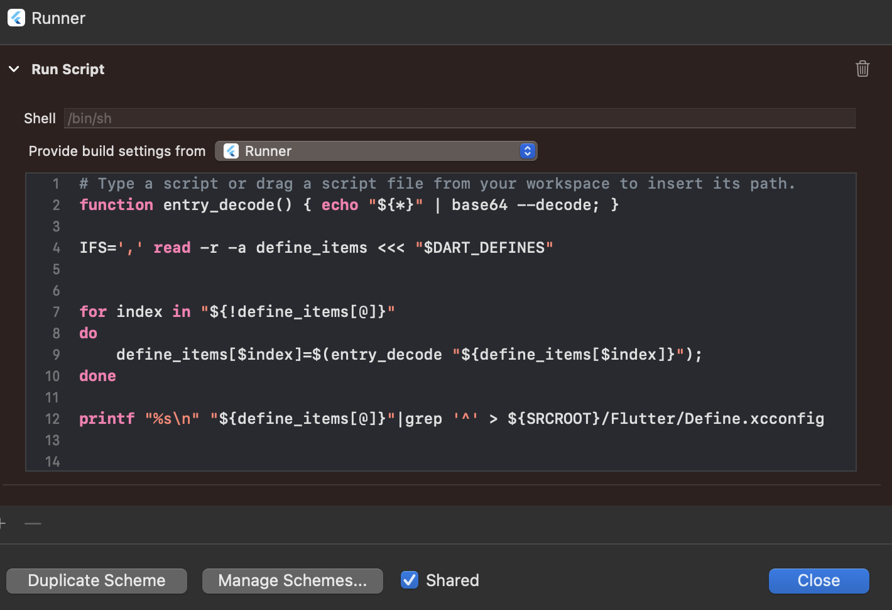

# app_config_flavors

Exemplo de como configurar Flavors utilizando dart-defines.

## Getting Started

### Gerar build usando dart-define

**Android**

Adicionar o script abaixo no build.gradle (app):

```
apply from: ...

def dartEnvironmentVariables = [
    APP_NAME: 'app_config_flavors',
    SUFFIX_NAME: null
];

if (project.hasProperty('dart-defines')) {
    dartEnvironmentVariables = dartEnvironmentVariables + project.property('dart-defines')
            .split(',')
            .collectEntries { entry ->
                def pair = new String(entry.decodeBase64(), 'UTF-8').split('=')
                [(pair.first()): pair.last()]
            }
}

android {
    ...
    defaultConfig {
        
        applicationIdSuffix dartEnvironmentVariables.SUFFIX_NAME
        ...
        resValue "string", "app_name", dartEnvironmentVariables.APP_NAME
    }
    ...
 }

 //No arquivo Manifest..
 <application
        android:label="@string/app_name"

```

Para gerar o arquivo apk ou bundle:

 **flutter build apk --dart-define-from-file=env.desenvolvimento.json --debug**


**IOS**

Adicionar o script abaixo no Pré-actions do Runner

```
function entry_decode() { echo "${*}" | base64 --decode; }

IFS=',' read -r -a define_items <<< "$DART_DEFINES"


for index in "${!define_items[@]}"
do
    define_items[$index]=$(entry_decode "${define_items[$index]}");
done

printf "%s\n" "${define_items[@]}"|grep '^' > ${SRCROOT}/Flutter/Define.xcconfig
```

### Edit Schema

### Pré-actions

### Build Script


Para gerar o arquivo ipa:

**flutter build ipa --dart-define-from-file=env.desenvolvimento.json**


